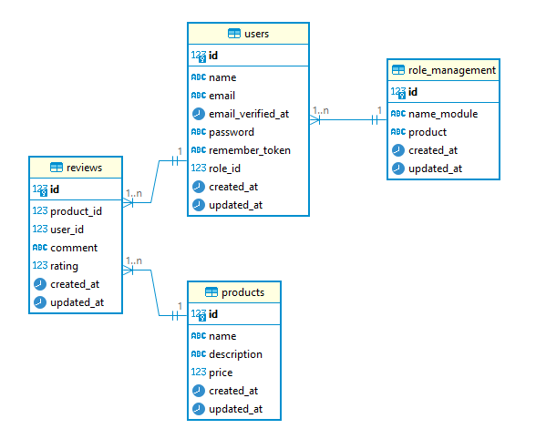

# Product Review : Diversition - Backend Candidate Assignment
Public Laravel + JWT + Docker Starter Project
---

## 🚀 วิธีใช้งาน

ก่อนเริ่มใช้งาน โปรดติดตั้ง Composer ให้เรียบร้อย

จากนั้นให้ทำตามขั้นตอนต่อไปนี้ **เรียงลำดับอย่างเคร่งครัด** เพื่อให้โปรเจกต์ทำงานได้อย่างถูกต้อง:

```bash
# Clone Project 
git clone https://github.com/ganran00121/product_review.git
cd product_review

# คัดลอกไฟล์ .env จากไฟล์ตัวอย่าง
cp .env.example .env

# สร้าง JWT secret สำหรับการเข้ารหัส token
php artisan jwt:secret

# ติดตั้ง dependencies ของ PHP ด้วย Composer
composer install

# ติดตั้ง dependencies ของ PHP ด้วย Composer
php artisan serve

# เปิด Docker แล้ว Build และรัน Docker containers ทั้งหมดใน background
docker-compose up -d --build

# รีเซ็ตฐานข้อมูลและ seed ข้อมูลตัวอย่าง
php artisan migrate:fresh --seed
```
---

## 🧩 ** ออกแบบฐานข้อมูล Database Schema **


### 🔸 ตาราง `users`

| Field       | Type            | Description               |
| ----------- | --------------- | ------------------------- |
| id          | bigint (PK)     | รหัสผู้ใช้                |
| name        | string          | ชื่อผู้ใช้                |
| email       | string (unique) | อีเมล                     |
| password    | string          | รหัสผ่าน (bcrypt)         |
| role\_id    | foreignId       | FK → role\_managements.id |
| created\_at | timestamp       | วันที่สร้าง               |
| updated\_at | timestamp       | วันที่อัปเดต              |

---

### 🔸 ตาราง `role_managements`

| Field   | Type        | Description               |
| -----   | ----------- | ------------------------- |
| id      | bigint (PK) | รหัสบทบาท                 |
| name    | string      | ชื่อบทบาท (admin, member) |
| product | text        | สิทธิในการใช้งาน (View, Create , Delete , Put) |

---

### 🔸 ตาราง `products`

| Field       | Type            | Description      |
| ----------- | --------------- | ---------------- |
| id          | bigint (PK)     | รหัสสินค้า       |
| name        | string          | ชื่อสินค้า       |
| description | text (nullable) | รายละเอียดสินค้า |
| price       | decimal(8,2)    | ราคาสินค้า       |
| created\_at | timestamp       | วันที่สร้าง      |
| updated\_at | timestamp       | วันที่อัปเดต     |

---

### 🔸 ตาราง `reviews`

| Field       | Type         | Description       |
| ----------- | ------------ | ----------------- |
| id          | bigint (PK)  | รหัสรีวิว         |
| user\_id    | foreignId    | FK → users.id     |
| product\_id | foreignId    | FK → products.id  |
| content     | text         | เนื้อหารีวิว      |
| rating      | decimal(2,1) | คะแนน (1.0 - 5.0) |
| created\_at | timestamp    | วันที่สร้าง       |
| updated\_at | timestamp    | วันที่อัปเดต      |

---


---
## 🛠️ เครื่องมือและ Framework ที่ใช้
| หมวด               | เครื่องมือ / Framework   | ใช้ทำอะไร                                    |
| ------------------ | ------------------------ | -------------------------------------------- |
| **Backend**        | Laravel Framework        | พัฒนา RESTful API (MVC, Routing, Middleware) |
| **Database**       | PostgreSQL       | เก็บข้อมูล User/Product/Review               |
| **Auth**           | `tymon/jwt-auth`         | ทำ JWT Authentication                        |
| **Seeder/Factory** | Laravel Seeder, Factory  | สร้างข้อมูลจำลองในฐานข้อมูล                  |
| **Testing Tool**   | Postman / Thunder Client | ใช้ทดสอบ API                                 |
| **Container**      | Docker + docker-compose  | รันแยก environment และเตรียมพร้อม deploy     |
| **Code Pattern**   | Repository / Service     | แยก logic เพื่อให้ทดสอบง่าย, clean code      |


## 🧪 Mock API Endpoints 
ไฟล์ Postman Collection file อยู่ในโปรเจค - POSTMAN - ชื่อไฟล์ Diversition-Test-Backend.postman_collection


